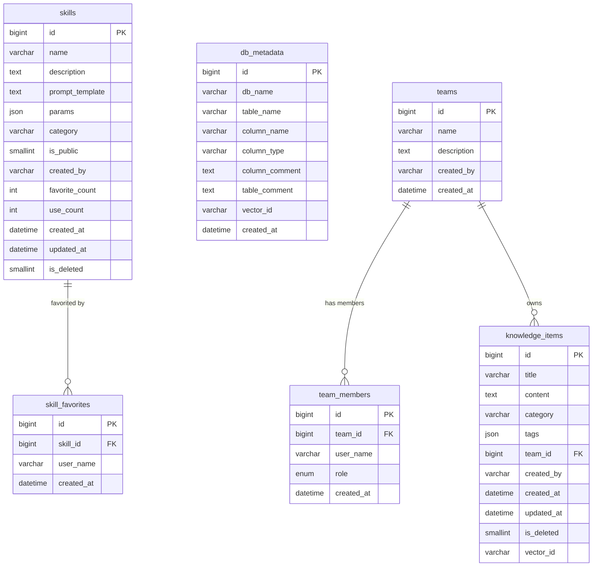

# Knowledge — 数据库设计

> 版本: 1.0 | 更新: 2026-03-27 | 数据库: MySQL 8.0 | 库名: knowledge

---

## 1. 数据域划分

| 数据域 | 表 | 说明 |
|--------|-----|------|
| 知识管理 | knowledge_items | 核心业务实体 |
| Skill 管理 | skills, skill_favorites | 提示词模板 + 收藏关系 |
| 元数据管理 | db_metadata | 数据库表结构元数据 |
| 团队管理 | teams, team_members | 团队空间 + 成员 |

---

## 2. 实体归属与主从关系

| 主表 | 从表 | 关系 | 级联策略 |
|------|------|------|---------|
| teams | team_members | 1:N | 删除团队 → 删除成员 |
| teams | knowledge_items | 1:N (team_id) | 删除团队 → 知识条目 team_id 置 NULL |
| skills | skill_favorites | 1:N | 删除 Skill → 删除收藏记录 |

### 软删除策略
- knowledge_items：软删除（is_deleted=1），保留数据用于恢复
- skills：软删除（is_deleted=1）
- 其他表：物理删除

---

## 3. Mermaid ER 图



---

## 4. 表定义

### 4.1 knowledge_items

#### DDL（以实际数据库为准）

```sql
CREATE TABLE `knowledge_items` (
  `id` bigint NOT NULL AUTO_INCREMENT,
  `title` varchar(255) NOT NULL,
  `content` text NOT NULL,
  `category` varchar(100) DEFAULT NULL,
  `tags` json DEFAULT NULL,
  `team_id` bigint DEFAULT NULL,
  `created_by` varchar(100) DEFAULT NULL,
  `created_at` datetime DEFAULT CURRENT_TIMESTAMP,
  `updated_at` datetime DEFAULT CURRENT_TIMESTAMP ON UPDATE CURRENT_TIMESTAMP,
  `is_deleted` smallint DEFAULT 0,
  `vector_id` varchar(100) DEFAULT NULL,
  PRIMARY KEY (`id`),
  KEY `ix_knowledge_items_category` (`category`),
  KEY `ix_knowledge_items_team_id` (`team_id`),
  KEY `ix_knowledge_items_created_at` (`created_at`)
) ENGINE=InnoDB DEFAULT CHARSET=utf8mb4 COLLATE=utf8mb4_unicode_ci;
```

#### 字段说明

| 字段 | 类型 | 业务含义 | 是否必填 | 备注 |
|------|------|---------|---------|------|
| id | bigint | 主键 | 自增 | — |
| title | varchar(255) | 知识标题 | 是 | 搜索关键字段 |
| content | text | 知识内容（Markdown） | 是 | 向量化源文本 |
| category | varchar(100) | 分类 | 否 | 如：数据库、业务、技术 |
| tags | json | 标签数组 | 否 | ["tag1","tag2"] |
| team_id | bigint | 所属团队 | 否 | NULL 表示个人知识 |
| created_by | varchar(100) | 创建者标识 | 否 | 当前无认证，前端传入 |
| is_deleted | smallint | 软删除标记 | — | 0=正常, 1=已删除 |
| vector_id | varchar(100) | 向量存储 ID | 否 | 关联向量索引 |

#### 索引设计

| 索引名 | 列 | 类型 | 覆盖的查询场景 |
|--------|-----|------|--------------|
| PRIMARY | id | 主键 | 详情查询 GET /knowledge/{id} |
| ix_knowledge_items_category | category | 普通 | 按分类筛选列表 |
| ix_knowledge_items_team_id | team_id | 普通 | 按团队筛选知识 |
| ix_knowledge_items_created_at | created_at | 普通 | 列表按时间排序 |

#### 查询场景

| 场景 | SQL | 命中索引 | 走缓存 | 最坏情况 | 读写比 |
|------|-----|---------|--------|---------|--------|
| 分页列表 | `SELECT * FROM knowledge_items WHERE is_deleted=0 ORDER BY created_at DESC LIMIT ?,?` | ix_created_at | ✅ 5min | 全表扫描（is_deleted 无索引，但数据量小可接受） | 读多写少 |
| 按分类筛选 | `... WHERE is_deleted=0 AND category=? ORDER BY created_at DESC` | ix_category | ✅ 5min | 分类值分布不均时退化 | 读多写少 |
| 详情查询 | `SELECT * FROM knowledge_items WHERE id=?` | PRIMARY | ✅ 10min | — | 读多写少 |
| 关键词搜索 | `... WHERE title LIKE '%keyword%' OR content LIKE '%keyword%'` | 无（全表扫描） | ❌ | 全表扫描，数据量大时需全文索引 | 读多写少 |
| 按团队筛选 | `... WHERE team_id=? AND is_deleted=0` | ix_team_id | ❌ | — | 读多写少 |

#### 分页方式
- offset 分页（`LIMIT offset, size`）
- 理由：数据量 < 10 万，offset 性能可接受；前端需要跳页功能

---

### 4.2 skills

#### DDL

```sql
CREATE TABLE `skills` (
  `id` bigint NOT NULL AUTO_INCREMENT,
  `name` varchar(255) NOT NULL,
  `description` text,
  `prompt_template` text NOT NULL,
  `params` json DEFAULT NULL,
  `category` varchar(100) DEFAULT NULL,
  `is_public` smallint DEFAULT 1,
  `created_by` varchar(100) DEFAULT NULL,
  `favorite_count` int DEFAULT 0,
  `use_count` int DEFAULT 0,
  `created_at` datetime DEFAULT CURRENT_TIMESTAMP,
  `updated_at` datetime DEFAULT CURRENT_TIMESTAMP ON UPDATE CURRENT_TIMESTAMP,
  `is_deleted` smallint DEFAULT 0,
  PRIMARY KEY (`id`),
  KEY `ix_skills_category` (`category`),
  KEY `ix_skills_is_public` (`is_public`)
) ENGINE=InnoDB DEFAULT CHARSET=utf8mb4 COLLATE=utf8mb4_unicode_ci;
```

#### 字段说明

| 字段 | 类型 | 业务含义 | 是否必填 | 备注 |
|------|------|---------|---------|------|
| id | bigint | 主键 | 自增 | — |
| name | varchar(255) | Skill 名称 | 是 | — |
| description | text | 描述 | 否 | — |
| prompt_template | text | 提示词模板 | 是 | 支持 {{param}} 占位符 |
| params | json | 参数定义 | 否 | [{"name":"x","type":"string","required":true}] |
| category | varchar(100) | 分类 | 否 | — |
| is_public | smallint | 是否公开 | — | 1=公开, 0=私有 |
| favorite_count | int | 收藏数 | — | 冗余计数，避免 COUNT 查询 |
| use_count | int | 使用次数 | — | 冗余计数 |
| is_deleted | smallint | 软删除 | — | 0=正常, 1=已删除 |

#### 索引设计

| 索引名 | 列 | 类型 | 覆盖的查询场景 |
|--------|-----|------|--------------|
| PRIMARY | id | 主键 | 详情查询 |
| ix_skills_category | category | 普通 | 按分类筛选 |
| ix_skills_is_public | is_public | 普通 | 公开 Skill 列表 |

#### 查询场景

| 场景 | SQL | 命中索引 | 走缓存 | 最坏情况 | 读写比 |
|------|-----|---------|--------|---------|--------|
| 公开列表 | `SELECT * FROM skills WHERE is_deleted=0 AND is_public=1 ORDER BY created_at DESC LIMIT ?,?` | ix_is_public | ✅ 5min | — | 读多写少 |
| 按分类 | `... AND category=?` | ix_category | ✅ 5min | — | 读多写少 |
| 详情 | `SELECT * FROM skills WHERE id=?` | PRIMARY | ✅ 10min | — | 读多写少 |

---

### 4.3 skill_favorites

#### DDL

```sql
CREATE TABLE `skill_favorites` (
  `id` bigint NOT NULL AUTO_INCREMENT,
  `skill_id` bigint NOT NULL,
  `user_name` varchar(100) NOT NULL,
  `created_at` datetime DEFAULT CURRENT_TIMESTAMP,
  PRIMARY KEY (`id`),
  UNIQUE KEY `uk_skill_user` (`skill_id`, `user_name`)
) ENGINE=InnoDB DEFAULT CHARSET=utf8mb4 COLLATE=utf8mb4_unicode_ci;
```

#### 字段说明

| 字段 | 类型 | 业务含义 | 是否必填 | 备注 |
|------|------|---------|---------|------|
| skill_id | bigint | 关联 Skill | 是 | — |
| user_name | varchar(100) | 收藏用户 | 是 | — |

#### 查询场景

| 场景 | SQL | 命中索引 | 走缓存 | 读写比 |
|------|-----|---------|--------|--------|
| 检查是否已收藏 | `SELECT 1 FROM skill_favorites WHERE skill_id=? AND user_name=?` | uk_skill_user | ❌ | 读多写少 |
| 用户收藏列表 | `SELECT skill_id FROM skill_favorites WHERE user_name=?` | 无（需加索引） | ❌ | 读多写少 |

---

### 4.4 db_metadata

#### DDL

```sql
CREATE TABLE `db_metadata` (
  `id` bigint NOT NULL AUTO_INCREMENT,
  `db_name` varchar(100) NOT NULL,
  `table_name` varchar(100) NOT NULL,
  `column_name` varchar(100) DEFAULT NULL,
  `column_type` varchar(100) DEFAULT NULL,
  `column_comment` text,
  `table_comment` text,
  `vector_id` varchar(100) DEFAULT NULL,
  `created_at` datetime DEFAULT CURRENT_TIMESTAMP,
  PRIMARY KEY (`id`),
  KEY `ix_db_metadata_table_name` (`table_name`),
  KEY `ix_db_metadata_db_table` (`db_name`, `table_name`)
) ENGINE=InnoDB DEFAULT CHARSET=utf8mb4 COLLATE=utf8mb4_unicode_ci;
```

#### 查询场景

| 场景 | SQL | 命中索引 | 走缓存 | 读写比 |
|------|-----|---------|--------|--------|
| 表列表 | `SELECT DISTINCT table_name, table_comment FROM db_metadata WHERE db_name=?` | ix_db_table | ✅ 30min | 读多写少 |
| 表字段详情 | `SELECT * FROM db_metadata WHERE db_name=? AND table_name=?` | ix_db_table | ✅ 30min | 读多写少 |

---

### 4.5 teams

#### DDL

```sql
CREATE TABLE `teams` (
  `id` bigint NOT NULL AUTO_INCREMENT,
  `name` varchar(255) NOT NULL,
  `description` text,
  `created_by` varchar(100) DEFAULT NULL,
  `created_at` datetime DEFAULT CURRENT_TIMESTAMP,
  PRIMARY KEY (`id`)
) ENGINE=InnoDB DEFAULT CHARSET=utf8mb4 COLLATE=utf8mb4_unicode_ci;
```

#### 查询场景

| 场景 | SQL | 命中索引 | 走缓存 | 读写比 |
|------|-----|---------|--------|--------|
| 团队列表 | `SELECT * FROM teams ORDER BY created_at DESC` | 无（数据量极小） | ❌ | 读多写少 |

---

### 4.6 team_members

#### DDL

```sql
CREATE TABLE `team_members` (
  `id` bigint NOT NULL AUTO_INCREMENT,
  `team_id` bigint NOT NULL,
  `user_name` varchar(100) NOT NULL,
  `role` enum('admin','editor','viewer') DEFAULT 'viewer',
  `created_at` datetime DEFAULT CURRENT_TIMESTAMP,
  PRIMARY KEY (`id`),
  UNIQUE KEY `uk_team_user` (`team_id`, `user_name`)
) ENGINE=InnoDB DEFAULT CHARSET=utf8mb4 COLLATE=utf8mb4_unicode_ci;
```

#### 查询场景

| 场景 | SQL | 命中索引 | 走缓存 | 读写比 |
|------|-----|---------|--------|--------|
| 团队成员列表 | `SELECT * FROM team_members WHERE team_id=?` | uk_team_user（前缀） | ❌ | 读多写少 |
| 检查成员角色 | `SELECT role FROM team_members WHERE team_id=? AND user_name=?` | uk_team_user | ❌ | 读多写少 |

---

## 5. 事务边界

| 操作 | 事务范围 | 说明 |
|------|---------|------|
| 创建知识 + 向量化 | 分离 | DB 写入成功即返回；向量化异步/容错，失败不回滚 |
| 收藏 Skill | 同一事务 | INSERT skill_favorites + UPDATE skills SET favorite_count=favorite_count+1 |
| 取消收藏 | 同一事务 | DELETE skill_favorites + UPDATE skills SET favorite_count=favorite_count-1 |
| 删除团队 | 同一事务 | DELETE team_members + DELETE teams |
| 导入元数据 | 同一事务 | DELETE 旧数据 + BATCH INSERT 新数据（同一 db_name+table_name） |

### 最终一致性场景
- 向量化：知识创建后异步向量化，短暂窗口内搜索不到新内容，可接受
- 缓存：写操作后主动删缓存，极端情况下有 TTL 窗口的脏读

---

## 6. Redis 缓存设计

### 6.1 Key 命名规则

格式：`knowledge:{模块}:{维度}:{参数}`

| Key 模式 | 示例 | 用途 | TTL | 失效策略 | 脏读容忍 |
|----------|------|------|-----|---------|---------|
| `knowledge:list:{page}:{size}:{category}` | `knowledge:list:1:20:` | 知识列表 | 300s | 创建/更新/删除时 DEL `knowledge:list:*` | 5min |
| `knowledge:detail:{id}` | `knowledge:detail:42` | 知识详情 | 600s | 更新/删除时 DEL | 不容忍 |
| `skills:list:{page}:{category}:{is_public}` | `skills:list:1::1` | Skill 列表 | 300s | 创建/更新/删除时 DEL `skills:list:*` | 5min |
| `skills:detail:{id}` | `skills:detail:7` | Skill 详情 | 600s | 更新/删除时 DEL | 不容忍 |
| `dashboard:stats` | `dashboard:stats` | 仪表盘统计 | 120s | TTL 自然过期 | 2min |
| `metadata:tables:{db_name}` | `metadata:tables:knowledge` | 表列表 | 1800s | 导入时 DEL | 30min |
| `metadata:table:{db_name}:{table_name}` | `metadata:table:knowledge:skills` | 表详情 | 1800s | 导入时 DEL | 30min |

### 6.2 TTL 策略
- 高频变更数据（知识列表、Skill 列表）：5 分钟
- 低频变更数据（元数据）：30 分钟
- 统计数据：2 分钟（接受短暂脏读）

### 6.3 失效策略
- 写操作（创建/更新/删除）→ 主动删除相关缓存 Key
- 统计数据 → TTL 自然过期（不值得主动失效）
- 列表缓存 → 使用 `SCAN` + `DEL` 批量失效（避免 `KEYS *`）

### 缓存防护
- 缓存穿透：查询不存在的 ID 时，缓存空值 60s
- 缓存雪崩：TTL 加随机偏移（±30s）
- 缓存击穿：热点 Key 使用 singleflight 模式（同一 Key 并发只查一次 DB）

---

## 7. 一致性模型

| 场景 | 一致性级别 | 说明 |
|------|-----------|------|
| 知识 CRUD | 强一致 | 写入 DB 后立即可读 |
| 列表缓存 | 最终一致 | 写操作后主动删缓存，但并发请求可能读到旧缓存 |
| 向量搜索 | 最终一致 | 向量化异步执行，新内容有短暂搜索不到的窗口 |
| 收藏计数 | 强一致 | 同一事务内更新 |
| 统计数据 | 最终一致 | 2 分钟 TTL，接受脏读 |

---

## 8. 迁移方案

### 当前状态 vs 设计差异

以下是实际数据库缺失的约束和索引，需要补充：

```sql
-- 1. knowledge_items 补充 created_at 索引
ALTER TABLE knowledge_items ADD INDEX ix_knowledge_items_created_at (created_at);

-- 2. skills 补充 is_public 索引
ALTER TABLE skills ADD INDEX ix_skills_is_public (is_public);

-- 3. db_metadata 补充复合索引
ALTER TABLE db_metadata ADD INDEX ix_db_metadata_db_table (db_name, table_name);

-- 4. team_members 补充唯一约束
ALTER TABLE team_members ADD UNIQUE KEY uk_team_user (team_id, user_name);

-- 5. skill_favorites 补充唯一约束
ALTER TABLE skill_favorites ADD UNIQUE KEY uk_skill_user (skill_id, user_name);

-- 6. knowledge_items 补充 updated_at 自动更新（实际表缺失 ON UPDATE）
ALTER TABLE knowledge_items MODIFY updated_at datetime DEFAULT CURRENT_TIMESTAMP ON UPDATE CURRENT_TIMESTAMP;

-- 7. skills 补充 updated_at 自动更新
ALTER TABLE skills MODIFY updated_at datetime DEFAULT CURRENT_TIMESTAMP ON UPDATE CURRENT_TIMESTAMP;
```

### 回滚方案

```sql
-- 回滚上述迁移
ALTER TABLE knowledge_items DROP INDEX ix_knowledge_items_created_at;
ALTER TABLE skills DROP INDEX ix_skills_is_public;
ALTER TABLE db_metadata DROP INDEX ix_db_metadata_db_table;
ALTER TABLE team_members DROP INDEX uk_team_user;
ALTER TABLE skill_favorites DROP INDEX uk_skill_user;
```
