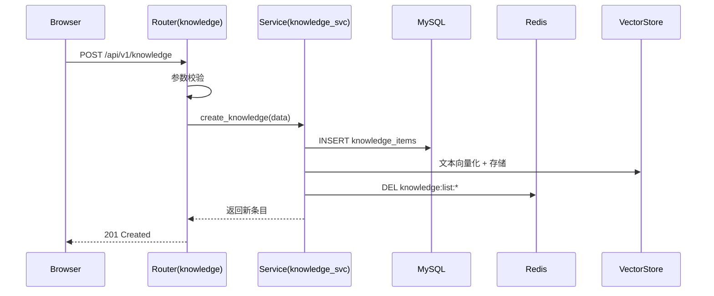
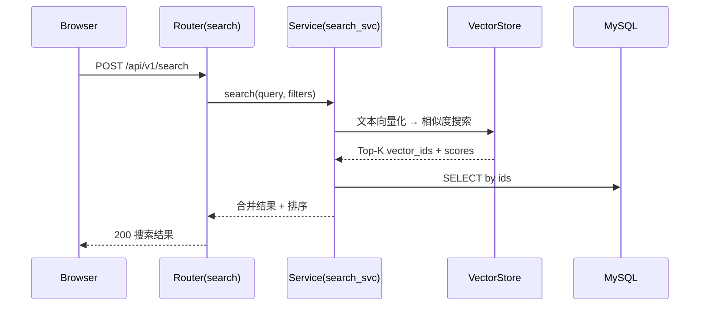
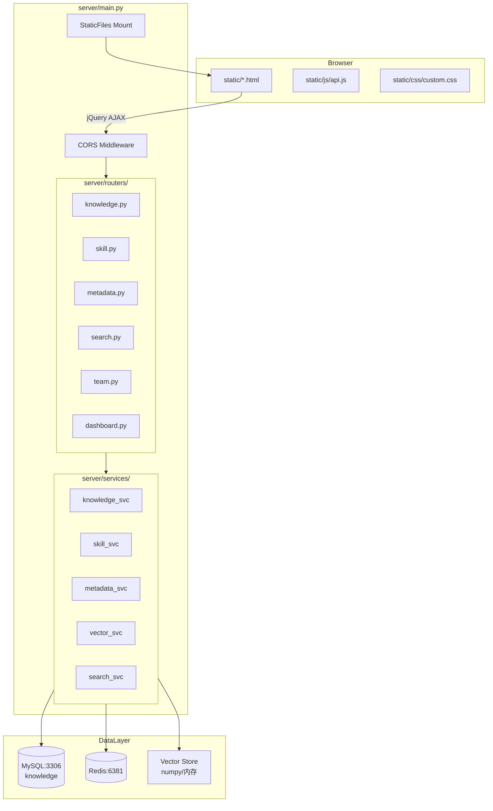
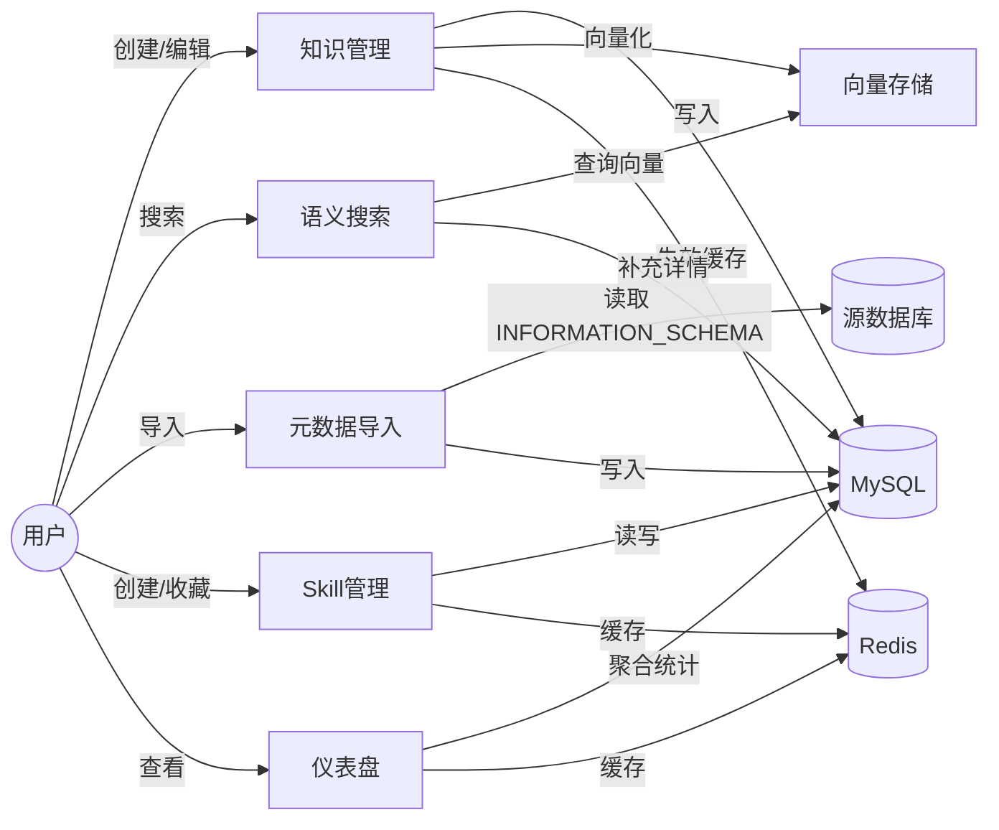

# Knowledge — 系统架构设计

> 版本: 2.0 | 更新: 2026-03-27 | 状态: approved

---

## 1. 范围（Scope）

### 做什么
- 知识条目的 CRUD 与分类管理（Markdown 格式）
- 基于关键词 / 向量的语义搜索
- 数据库元数据（表结构、字段）导入与浏览
- Skill（提示词模板）的创建、分享、收藏
- 团队空间与成员权限管理
- 仪表盘统计概览

### 不做什么
- 不做用户注册/登录系统（当前阶段用 created_by 字符串标识）
- 不做文件/附件上传
- 不做实时协作编辑
- 不做审计日志
- 不做多租户隔离（团队空间是逻辑隔离，非物理隔离）

### 外部集成点
| 集成点 | 方向 | 说明 |
|--------|------|------|
| MySQL (knowledge) | 读写 | 主数据存储 |
| Redis (6381) | 读写 | 缓存层 |
| 嵌入模型 API | 出站 | 文本向量化（预留，当前用内置方案） |

---

## 2. 目标与非目标

### 目标
- 搜索响应时间 < 2s
- 页面首屏加载 < 3s
- 支持 100 并发用户
- 知识条目支持 Markdown 格式
- 向量搜索可插拔（内置 → Milvus/Qdrant）

### 非目标
- 不追求毫秒级搜索延迟
- 不支持百万级数据量（当前设计上限 10 万条知识）
- 不做移动端原生适配（仅响应式 Web）
- 不做离线访问

---

## 3. 架构总览

单体架构，前后端分离部署在同一进程：

```
Browser (HTML/TailwindCSS/jQuery)
        │ HTTP/REST
        ▼
FastAPI Server (:9999)
├── CORS Middleware
├── Static Files Mount (→ /static)
├── API Routers (/api/v1/*)
│   ├── knowledge   — 知识 CRUD
│   ├── skill       — Skill CRUD + 收藏
│   ├── metadata    — 元数据导入/浏览
│   ├── search      — 搜索（关键词 + 向量）
│   ├── team        — 团队管理
│   └── dashboard   — 统计概览
├── Service Layer
│   ├── knowledge_svc
│   ├── skill_svc
│   ├── metadata_svc
│   ├── vector_svc   — 向量化 + 相似度计算
│   └── search_svc   — 搜索编排
└── Data Layer
    ├── MySQL (knowledge)  — 结构化数据
    ├── Redis (6381)       — 缓存
    └── Vector Store       — 内置 numpy（可替换）
```

前端静态文件由 FastAPI `StaticFiles` 挂载，通过 jQuery AJAX 调用 `/api/v1/*` 接口。

---

## 4. 模块职责

| 模块 | 职责 | 可调用 | 不可直接调用 |
|------|------|--------|-------------|
| routers/* | HTTP 入参校验、响应序列化 | services/* | models/*（禁止直接操作 DB） |
| services/* | 业务逻辑、事务编排、缓存协调 | models/*, redis_client | routers/* |
| models/* | ORM 模型定义、数据库映射 | — | — |
| redis_client | 缓存读写封装 | — | — |
| vector_svc | 文本向量化、相似度计算 | — | — |
| config | 配置加载（环境变量） | — | — |
| database | 连接池、Session 管理 | — | — |

依赖方向：`routers → services → models/redis/vector`（单向，禁止循环）

> 注意：当前实现中 routers 直接操作 models（跳过 services），这是已知技术债务，后续迭代应引入 service 层。

---

## 5. 技术选型及理由

| 技术 | 选择 | 理由 | 备选 |
|------|------|------|------|
| 后端框架 | FastAPI | 异步、自动 OpenAPI 文档、Python 生态 | Flask（同步）、Django（太重） |
| ORM | SQLAlchemy 2.0 (async) | 成熟、异步支持好 | Tortoise ORM（社区小） |
| 数据库 | MySQL 8.0 | 团队熟悉、config.json 指定 | PostgreSQL（向量扩展更好但未配置） |
| 缓存 | Redis | 高性能 KV、config.json 指定 | Memcached（功能少） |
| 前端 | HTML + TailwindCSS CDN + jQuery | 零构建、快速迭代、config.json 指定 | React/Vue（需构建工具） |
| 向量存储 | 内置 numpy | 简单、零依赖、数据量小 | Milvus/Qdrant（数据量大时切换） |
| 进程管理 | nohup + restart.sh | 简单部署 | systemd/supervisor（生产环境） |

---

## 6. 目录结构与代码组织

```
knowledge/
├── server/                     # 后端 Python 包
│   ├── __init__.py
│   ├── main.py                 # FastAPI 入口，挂载中间件和路由
│   ├── config.py               # 环境变量配置（DB/Redis）
│   ├── database.py             # SQLAlchemy 异步引擎 + Session
│   ├── redis_client.py         # Redis 连接池 + 缓存工具函数
│   ├── models/                 # SQLAlchemy ORM 模型
│   │   ├── __init__.py         # 统一导出所有模型
│   │   ├── knowledge.py        # KnowledgeItem
│   │   ├── skill.py            # Skill, SkillFavorite
│   │   ├── metadata.py         # DbMetadata
│   │   └── team.py             # Team, TeamMember
│   ├── routers/                # API 路由（入参校验 + 响应）
│   │   ├── __init__.py
│   │   ├── knowledge.py        # /api/v1/knowledge
│   │   ├── skill.py            # /api/v1/skills
│   │   ├── metadata.py         # /api/v1/metadata
│   │   ├── search.py           # /api/v1/search
│   │   ├── team.py             # /api/v1/teams
│   │   └── dashboard.py        # /api/v1/dashboard
│   ├── services/               # 业务逻辑层（预留）
│   │   ├── __init__.py
│   │   ├── knowledge_svc.py
│   │   ├── skill_svc.py
│   │   ├── metadata_svc.py
│   │   ├── vector_svc.py
│   │   └── search_svc.py
│   └── requirements.txt
├── static/                     # 前端静态文件
│   ├── index.html              # 仪表盘 /
│   ├── knowledge.html          # 知识列表 /knowledge
│   ├── search.html             # 语义搜索 /search
│   ├── skills.html             # Skill 市场 /skills
│   ├── metadata.html           # 元数据浏览 /metadata
│   ├── teams.html              # 团队管理 /teams
│   ├── js/
│   │   ├── api.js              # API 接口封装（fetch wrapper）
│   │   ├── app.js              # 全局初始化（sidebar、主题）
│   │   ├── components.js       # 通用 UI 组件（toast、modal、分页）
│   │   └── utils.js            # 工具函数
│   └── css/
│       └── custom.css          # 自定义样式（动画、连接线）
├── logs/                       # 运行日志
│   ├── backend.log
│   └── frontend.log
├── restart.sh                  # 启动/重启脚本
├── .env                        # 环境变量
└── README.md
```

---

## 7. 安全模型

### 当前状态（V1）
- **认证**：无。created_by 字段由前端传入，不可信
- **授权**：无。团队角色（admin/editor/viewer）已建模但未强制执行
- **CORS**：全开（`allow_origins=["*"]`），仅限内网使用

### 安全基线（必须遵守）
| 威胁 | 防护措施 | 状态 |
|------|---------|------|
| SQL 注入 | SQLAlchemy 参数化查询 | ✅ 已实现 |
| XSS | TailwindCSS 无内联 HTML；内容展示需转义 | ⚠️ Markdown 渲染需注意 |
| CSRF | 无 Cookie 认证，REST API 天然免疫 | ✅ |
| 越权访问 | 团队数据隔离查询需加 team_id 过滤 | ⚠️ 未强制 |
| 数据泄露 | 软删除数据不应出现在列表/搜索结果中 | ✅ is_deleted 过滤 |

### 后续迭代建议
- 引入 JWT Token 认证
- 路由级权限中间件
- 输入长度限制（title ≤ 255, content ≤ 100KB）

---

## 8. 错误处理策略

### 错误分层

| 层级 | 处理方式 | 示例 |
|------|---------|------|
| 用户可见 | 返回友好 message + 业务错误码 | 知识条目不存在、参数校验失败 |
| 内部重试 | 自动重试 + 日志 | Redis 连接超时、DB 短暂不可用 |
| 静默吞并 | 记录日志，不影响主流程 | 缓存写入失败、向量化失败 |

### 统一错误码体系

| 错误码 | 含义 | HTTP Status |
|--------|------|-------------|
| VALIDATION_ERROR | 参数校验失败 | 400 |
| NOT_FOUND | 资源不存在 | 404 |
| CONFLICT | 资源冲突（重复收藏等） | 409 |
| INTERNAL_ERROR | 服务端内部错误 | 500 |

### 幂等路径
- PUT /knowledge/{id} — 幂等，重复更新结果一致
- DELETE /knowledge/{id} — 幂等，重复删除返回成功
- POST /skills/{id}/favorite — 幂等，toggle 语义

### 降级策略
- Redis 不可用 → 跳过缓存，直接查 DB
- 向量服务不可用 → 降级为关键词搜索
- 嵌入模型 API 不可用 → 跳过向量化，仅存文本

---

## 9. 性能与扩展性

### 性能预算

| 指标 | 目标 | 依据 |
|------|------|------|
| API P99 延迟 | < 500ms | 内网访问，数据量 < 10 万 |
| 搜索延迟 | < 2s | 需求要求 |
| 首屏加载 | < 3s | CDN 加载 TailwindCSS + jQuery |
| 并发用户 | 100 | 需求要求 |
| DB 连接池 | 10 + 20 overflow | 100 并发足够 |

### 容量假设

| 数据 | 预估上限 | 单条大小 | 总量 |
|------|---------|---------|------|
| 知识条目 | 10 万 | ~5KB | ~500MB |
| Skill | 1 万 | ~2KB | ~20MB |
| 元数据 | 5 万列 | ~200B | ~10MB |
| 向量 | 10 万 | ~3KB (768维) | ~300MB |

### 缓存策略（概要）
- 列表页：Redis 缓存 5 分钟，写操作主动失效
- 详情页：Redis 缓存 10 分钟，更新时主动删除
- 统计数据：Redis 缓存 2 分钟，接受短暂脏读
- 元数据表列表：Redis 缓存 30 分钟（变更频率低）

> 具体 Key 命名和 TTL 详见 `db-design.md` 第 6 章

---

## 10. 可观测性

### 日志规范
- 格式：`[时间] [级别] [模块] [traceId] 消息`
- 级别：ERROR（必须处理）、WARN（需关注）、INFO（关键操作）、DEBUG（开发调试）
- 关键操作必须记录：创建/删除知识、导入元数据、搜索请求

### 健康检查
- `GET /api/v1/health` — 返回 DB 和 Redis 连接状态
- 检查项：MySQL 连接、Redis PING、向量服务状态

### 监控指标（预留）
- API 请求量 / 错误率 / 延迟分布
- DB 连接池使用率
- Redis 命中率
- 搜索请求量 / 平均延迟

---

## 11. 数据流

### 知识创建流程



### 搜索流程



---

## 12. 对其他文档的约束

| 文档 | 约束 |
|------|------|
| `db-design.md` | 表名必须和 `server/models/` 中的 `__tablename__` 一致；索引必须有查询场景支撑 |
| `frontend-design.md` | 设计风格/配色/字体必须从 config.json 读取；API 调用只引用 api-spec.yaml 的 operationId |
| `api-spec.yaml` | 字段命名统一 snake_case；分页参数统一 page/page_size；错误响应统一 ErrorResponse |
| `execution-plan.md` | 任务粒度 1-2 小时；标注前后端并行关系 |

---

## 附录 A. Mermaid 系统架构图



## 附录 B. Mermaid 数据流图


