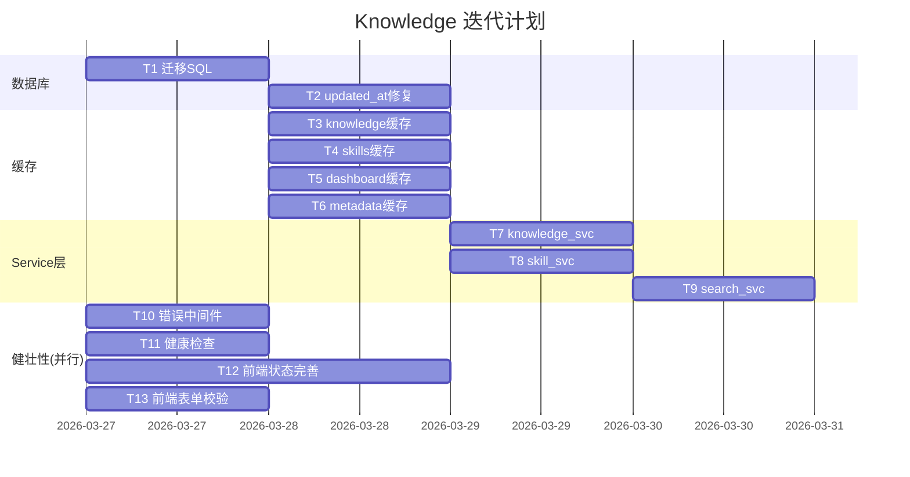

# Knowledge — 执行计划

> 版本: 2.0 | 更新: 2026-03-27 | 状态: 迭代中

---

## 当前进度

| 阶段 | 状态 | 说明 |
|------|------|------|
| 后端骨架 + DB | ✅ 完成 | FastAPI + SQLAlchemy + 6 张表 |
| API 路由 | ✅ 完成 | 全部 CRUD 路由已实现 |
| 前端页面 | ✅ 完成 | 6 个页面 + 视觉优化 |
| 架构文档 | ✅ 完成 | design/db-design/frontend-design/api-spec |
| 数据库迁移 | 🔲 待做 | 补充缺失索引和约束 |
| Redis 缓存集成 | 🔲 待做 | 路由层接入缓存 |
| Service 层重构 | 🔲 待做 | 从 router 抽离业务逻辑 |
| 向量搜索升级 | 🔲 待做 | 从关键词搜索升级为向量搜索 |
| 健康检查接口 | 🔲 待做 | GET /api/v1/health |

---

## 待执行任务

### 阶段 1：数据库补全（后端）

| # | 任务 | 预估 | 依赖 |
|---|------|------|------|
| T1 | 执行迁移 SQL：补充索引 + 唯一约束（见 db-design.md 第 8 章） | 0.5h | 无 |
| T2 | 补充 updated_at ON UPDATE 自动更新 | 0.5h | T1 |

### 阶段 2：缓存集成（后端）

| # | 任务 | 预估 | 依赖 |
|---|------|------|------|
| T3 | knowledge 路由接入 Redis 缓存（列表 + 详情） | 1.5h | T1 |
| T4 | skills 路由接入 Redis 缓存 | 1h | T1 |
| T5 | dashboard stats 接入 Redis 缓存 | 0.5h | T1 |
| T6 | metadata 路由接入 Redis 缓存 | 0.5h | T1 |

### 阶段 3：Service 层（后端）

| # | 任务 | 预估 | 依赖 |
|---|------|------|------|
| T7 | 抽离 knowledge_svc（CRUD + 缓存失效） | 1.5h | T3 |
| T8 | 抽离 skill_svc（CRUD + 收藏事务） | 1h | T4 |
| T9 | 抽离 search_svc + vector_svc 骨架 | 1h | T7 |

### 阶段 4：健壮性（前后端并行）

| # | 任务 | 负责 | 预估 | 依赖 |
|---|------|------|------|------|
| T10 | 统一错误响应中间件（ErrorResponse 格式） | 后端 | 1h | 无 |
| T11 | 健康检查接口 /api/v1/health | 后端 | 0.5h | 无 |
| T12 | 前端错误状态 + 空状态 + loading 骨架屏完善 | 前端 | 1.5h | 无 |
| T13 | 前端表单校验（知识 + Skill 表单） | 前端 | 1h | 无 |

---

## 依赖关系

---

## 并行策略

- T3/T4/T5/T6 可并行（各模块缓存独立）
- T10/T11（后端）与 T12/T13（前端）可并行
- T7/T8 依赖对应缓存任务完成后才能开始
