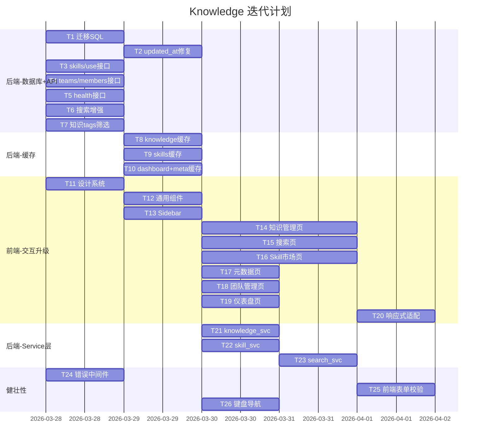

# Knowledge — 执行计划

> 版本: 2.1 | 更新: 2026-03-28 | 状态: 迭代中
> 变更: 同步 ui-design.md v2.0，增加前端交互设计实现任务

---

## 当前进度

| 阶段 | 状态 | 说明 |
|------|------|------|
| 后端骨架 + DB | ✅ 完成 | FastAPI + SQLAlchemy + 6 张表 |
| API 路由 | ✅ 完成 | 全部 CRUD 路由已实现 |
| 前端页面 | ✅ 完成 | 6 个页面基础版本 |
| 架构文档 | ✅ 完成 | design/db-design/frontend-design/api-spec 已更新 |
| 交互设计 | ✅ 完成 | ui-design.md v2.0 |
| 数据库迁移 | 🔲 待做 | 补充缺失索引和约束 |
| Redis 缓存集成 | 🔲 待做 | 路由层接入缓存 |
| Service 层重构 | 🔲 待做 | 从 router 抽离业务逻辑 |
| 前端交互升级 | 🔲 待做 | 按 ui-design.md 重构前端 |
| 新增 API 实现 | 🔲 待做 | skills/use、teams/members/{uid}、health |
| 向量搜索升级 | 🔲 待做 | 从关键词搜索升级为向量搜索 |

---

## 待执行任务

### 阶段 1：数据库补全 + 新增 API（后端）

| # | 任务 | 预估 | 依赖 | 负责 |
|---|------|------|------|------|
| T1 | 执行迁移 SQL：补充索引 + 唯一约束（见 db-design.md 第 8 章） | 0.5h | 无 | 后端 |
| T2 | 补充 updated_at ON UPDATE 自动更新 | 0.5h | T1 | 后端 |
| T3 | 实现 POST /api/v1/skills/{id}/use（使用次数统计） | 0.5h | 无 | 后端 |
| T4 | 实现 PUT/DELETE /api/v1/teams/{id}/members/{uid}（成员角色管理） | 1h | 无 | 后端 |
| T5 | 实现 GET /api/v1/health（健康检查） | 0.5h | 无 | 后端 |
| T6 | 搜索接口增加 source_type/time_range 过滤 + score 返回 | 1h | 无 | 后端 |
| T7 | 知识列表接口增加 tags 筛选参数 | 0.5h | 无 | 后端 |

### 阶段 2：缓存集成（后端）

| # | 任务 | 预估 | 依赖 | 负责 |
|---|------|------|------|------|
| T8 | knowledge 路由接入 Redis 缓存（列表 + 详情） | 1.5h | T1 | 后端 |
| T9 | skills 路由接入 Redis 缓存 | 1h | T1 | 后端 |
| T10 | dashboard stats + metadata 接入 Redis 缓存 | 1h | T1 | 后端 |

### 阶段 3：前端交互升级（前端，与阶段 2 并行）

| # | 任务 | 预估 | 依赖 | 负责 |
|---|------|------|------|------|
| T11 | 设计系统实现：CSS 变量 + 字体加载 + 全局样式 | 1h | 无 | 前端 |
| T12 | 通用组件升级：Toast/Modal/Confirm/Skeleton/EmptyState（按 ui-design.md 规范） | 2h | T11 | 前端 |
| T13 | Sidebar 升级：折叠/展开 + 响应式 + 状态持久化 + 系统状态指示 | 1h | T11 | 前端 |
| T14 | 知识管理页重构：卡片网格 + 标签多选筛选 + 创建/编辑/详情 Modal | 2h | T12 | 前端 |
| T15 | 搜索页重构：居中大搜索框 → 上移 + 过滤面板 + infinite scroll + 高亮匹配 | 2h | T12 | 前端 |
| T16 | Skill 市场页重构：分类 Tab + 卡片网格 + 详情 Modal + 参数填写 + 一键复制 | 2h | T12 | 前端 |
| T17 | 元数据页重构：master-detail 布局 + 导入进度 + 索引 Badge | 1.5h | T12 | 前端 |
| T18 | 团队管理页重构：团队卡片 + 成员管理 Modal + 角色下拉 | 1.5h | T12 | 前端 |
| T19 | 仪表盘页重构：统计卡片动画 + 快捷操作 + 系统信息 | 1h | T12 | 前端 |
| T20 | 响应式适配：3 断点布局 + 动效 + prefers-reduced-motion | 1.5h | T14-T19 | 前端 |

### 阶段 4：Service 层重构（后端）

| # | 任务 | 预估 | 依赖 | 负责 |
|---|------|------|------|------|
| T21 | 抽离 knowledge_svc（CRUD + 缓存失效） | 1.5h | T8 | 后端 |
| T22 | 抽离 skill_svc（CRUD + 收藏事务） | 1h | T9 | 后端 |
| T23 | 抽离 search_svc + vector_svc 骨架 | 1h | T21 | 后端 |

### 阶段 5：健壮性（前后端并行）

| # | 任务 | 预估 | 依赖 | 负责 |
|---|------|------|------|------|
| T24 | 统一错误响应中间件（ErrorResponse 格式） | 1h | 无 | 后端 |
| T25 | 前端表单校验完善（知识 + Skill 表单 onBlur 校验） | 1h | T14, T16 | 前端 |
| T26 | 前端键盘导航（Tab/Enter/ESC/快捷键） | 0.5h | T12 | 前端 |

---

## 依赖关系

---

## 并行策略

- 阶段 1 的 T3-T7 可全部并行（独立接口）
- 阶段 2（后端缓存）与阶段 3（前端交互升级）完全并行
- T14/T15/T16 可并行（各页面独立重构）
- T17/T18/T19 可并行
- T24（后端错误中间件）与前端任务并行

---

## 工时估算

| 角色 | 任务数 | 总工时 |
|------|--------|--------|
| 后端 | T1-T10, T21-T24 | ~12h |
| 前端 | T11-T20, T25-T26 | ~17h |
| 合计 | 26 个任务 | ~29h |
